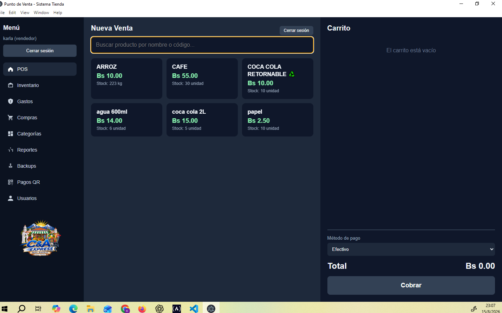
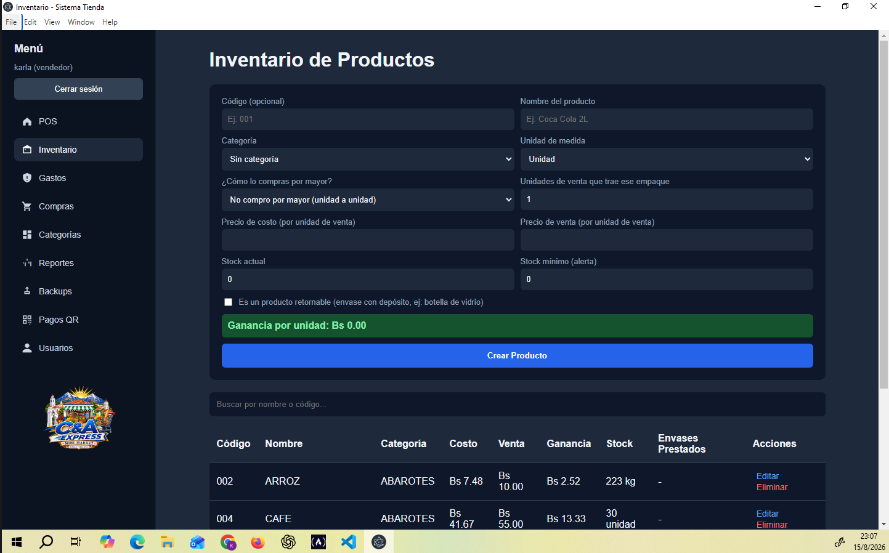
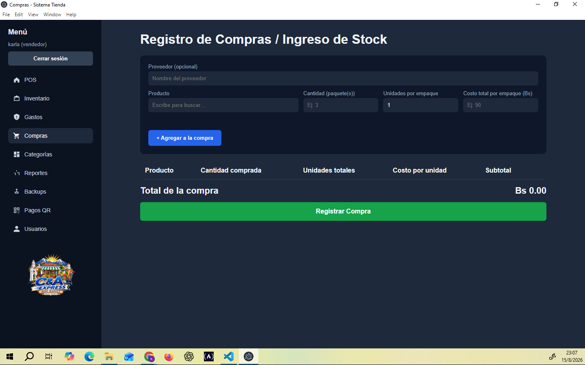
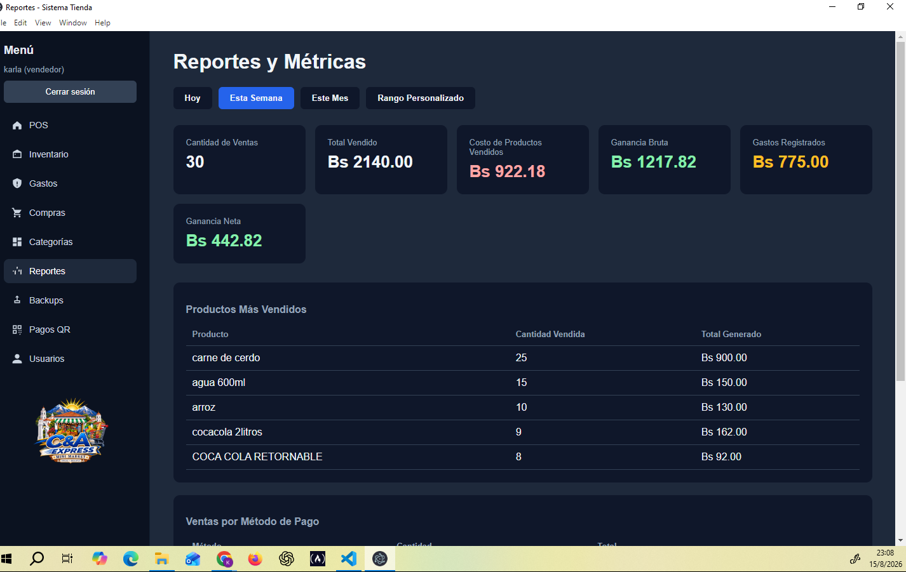

<div align="center">
  

  # Sistema Tienda — POS y Control de Inventarios

  Sistema de punto de venta y gestión de inventario a medida, desarrollado para **C&A Express Mini Market** (Sucre, Bolivia).
</div>

---

## 📌 ¿Para qué sirve este sistema?

Este proyecto nació de una necesidad simple pero fundamental para cualquier tienda: **dejar de manejar las ventas, las compras y el inventario "a ojo" o en cuadernos**, y tener siempre a la mano tres respuestas claras:

- 💰 **¿Cuánto estoy ganando de verdad?** — no solo cuánto vendo, sino cuánto queda de ganancia real después de descontar lo que costó cada producto.
- 📦 **¿Qué tengo en stock, y qué se me está por acabar?** — para nunca quedarte sin un producto que se vende bien, ni comprar de más algo que no rota.
- 📊 **¿Cómo va mi negocio hoy, esta semana, este mes?** — con números concretos, no con la sensación de "hoy vendí bien" o "hoy vendí mal".

El sistema automatiza el trabajo repetitivo (calcular ganancias, descontar stock al vender, convertir compras por mayor a unidades de venta) para que el dueño y el personal de caja se enfoquen en atender a los clientes, no en hacer cuentas.

---

## 🖼️ Capturas del sistema

> *Agrega tus propias capturas de pantalla en la carpeta `docs/screenshots/` con estos nombres, y se mostrarán automáticamente aquí.*

| Pantalla | Vista previa |
|---|---|
| Punto de Venta (POS) |  |
| Inventario |  |
| Compras |  |
| Reportes |  |
| Pagos QR |  |

---

## ✨ Funcionalidades

- **Punto de Venta (POS)** — buscador rápido de productos, carrito de compra, cálculo de totales en tiempo real y múltiples métodos de pago (efectivo, tarjeta, QR).
- **Inventario** — alta y edición de productos, cálculo automático de ganancia por unidad, alerta visual cuando el stock baja del mínimo.
- **Compras / ingreso de stock** — registro por caja, quintal, docena, etc., con conversión automática a unidades de venta. Compara el costo actual contra la compra anterior y **avisa en rojo si tu ganancia bajó** o si estarías vendiendo a pérdida.
- **Categorías** — organización de productos por tipo.
- **Ventas y cobro** — registro de la venta, descuento automático de stock y cálculo de ganancia real, todo como una sola operación segura (si algo falla, no se guarda nada a medias).
- **Productos retornables** — manejo de envases con depósito (botellas retornables): cobra el depósito solo si el cliente no trae su envase, y lleva el conteo de envases prestados por producto.
- **Reportes y métricas** — ventas, costos y ganancia neta filtrados por hoy / semana / mes / rango personalizado, productos más vendidos y ventas por método de pago.
- **Gastos** — registro de gastos operativos del negocio, descontados automáticamente de la ganancia neta en los reportes.
- **Usuarios y roles** — login con contraseña cifrada, roles de administrador y vendedor.
- **Pagos QR automáticos** — panel en vivo que recibe y muestra las notificaciones de pago QR del celular del dueño, sin que el cajero tenga que revisar el teléfono.
- **Copias de seguridad** — creación, descarga y restauración de respaldos de la base de datos con un clic.

---

## 🛠️ Tecnologías utilizadas

| Capa | Tecnología | Por qué se eligió |
|---|---|---|
| Interfaz de escritorio | **Electron** | Permite empaquetar el sistema como una aplicación de escritorio real (`.exe`), sin depender de un navegador ni de internet. |
| Backend / servidor | **Node.js + Express** | Framework simple y liviano para manejar toda la lógica del negocio (ventas, stock, reportes) a través de una API. |
| Base de datos | **SQLite** (vía `better-sqlite3`) | Base de datos local en un solo archivo, sin necesidad de instalar ni configurar un servidor de base de datos aparte — ideal para una tienda con una sola caja. |
| Frontend | **HTML, CSS y JavaScript puro** | Sin frameworks pesados: pantallas rápidas y fáciles de mantener, consumiendo la API del backend con `fetch`. |
| Seguridad de contraseñas | **bcryptjs** | Cifrado de contraseñas de usuario, sin guardar nunca texto plano. |
| Empaquetado | **electron-builder** | Genera el instalador `.exe` final que se le entrega a la tienda. |

---

## 📁 Estructura del proyecto

```
mi-sistema-tienda/
│
├── main.js                  # Punto de entrada de Electron
├── package.json
│
├── database/
│   ├── database.js          # Conexión, inicialización y migraciones de la BD
│   ├── init.sql              # Esquema de las tablas
│   └── tienda.db             # Base de datos (se genera automáticamente)
│
├── backend/
│   ├── server.js             # Servidor Express
│   ├── routes/                # Endpoints de la API, por módulo
│   └── controllers/           # Lógica de negocio, por módulo
│
└── frontend/
    ├── assets/
    │   ├── css/                # Estilos por pantalla
    │   ├── js/                 # Lógica de cada pantalla + menú lateral
    │   └── img/                 # Logo e imágenes
    └── views/                  # Pantallas (POS, Inventario, Compras, Reportes...)
```

---

## 📦 Cómo se empaquetó (y por qué)

El sistema se desarrolla y prueba normalmente con:

```bash
npm start
```

Pero para entregarlo a la tienda, no tiene sentido pedirle al personal que instale Node.js, abra una terminal, y escriba comandos. Por eso se generó un **instalador de Windows** con `electron-builder`:

```bash
npm run dist
```

Esto produce un archivo `Sistema Tienda Setup X.X.X.exe` que:
- Se instala con un asistente normal, como cualquier programa de Windows.
- Crea un acceso directo en el escritorio.
- No requiere que la computadora tenga Node.js, npm, ni ninguna herramienta de desarrollo instalada — todo (incluyendo el motor de la base de datos) queda empaquetado dentro del `.exe`.

### Decisiones técnicas clave del empaquetado

- **Ubicación de la base de datos:** en desarrollo, `tienda.db` vive dentro de la carpeta del proyecto. Pero una vez empaquetada, esa carpeta queda "sellada" (de solo lectura) dentro del instalador — SQLite no podría escribir ahí. Por eso, `database.js` detecta automáticamente si la app está empaquetada (`app.isPackaged`) y, en ese caso, guarda la base de datos en la carpeta de datos de Windows (`AppData`), que sí es escribible. Esto también significa que **los datos persisten** aunque se reinstale o actualice la app.
- **Módulo nativo (`better-sqlite3`):** al ser un módulo compilado en C++, tuvo que recompilarse específicamente para la versión de Node.js que usa Electron (distinta a la de Windows), y quedó excluido del empaquetado comprimido (`asarUnpack`) porque los módulos nativos no pueden ejecutarse desde dentro de un archivo empaquetado `.asar`.
- **Copias de seguridad:** por el mismo motivo que la base de datos, la carpeta de backups también se reubica automáticamente dentro de `AppData` cuando la app está empaquetada.

---

## 🚀 Cómo correr el proyecto en desarrollo

```bash
npm install
npm start
```

## 🏗️ Cómo generar el instalador

```bash
npm run dist
```

El archivo `.exe` resultante queda en la carpeta `dist/`.

---

<div align="center">
  <sub>Desarrollado a medida para C&A Express Mini Market — Sucre, Bolivia 🇧🇴</sub>
</div>
